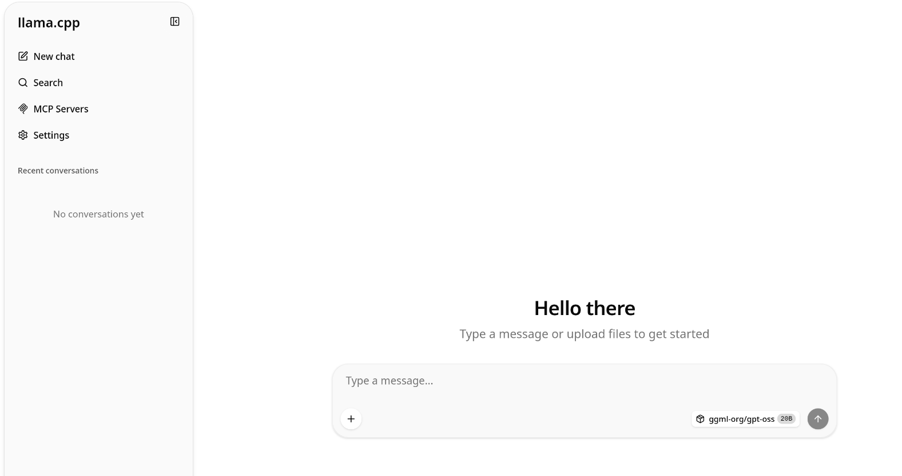
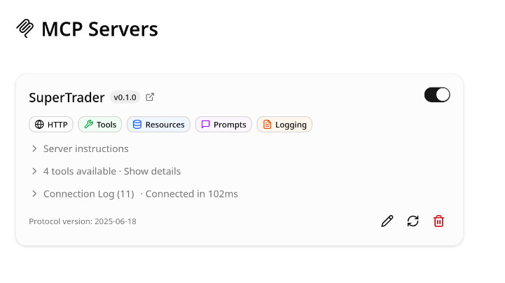
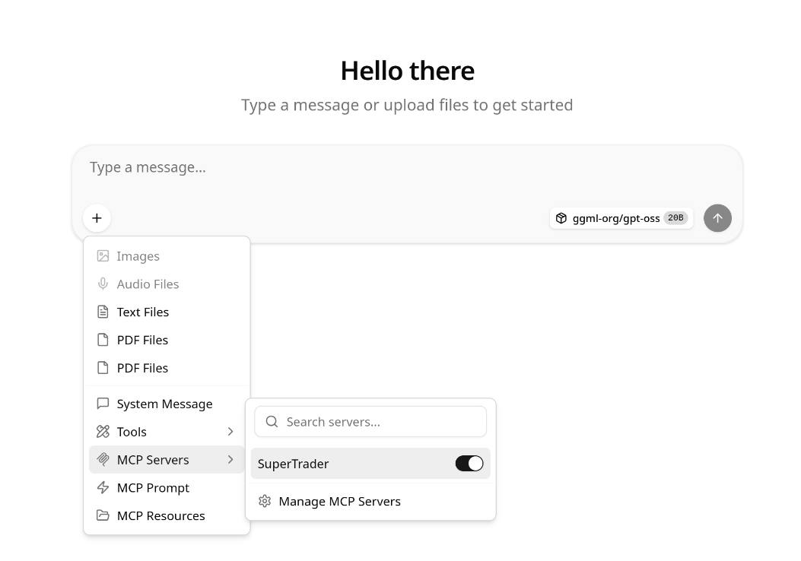
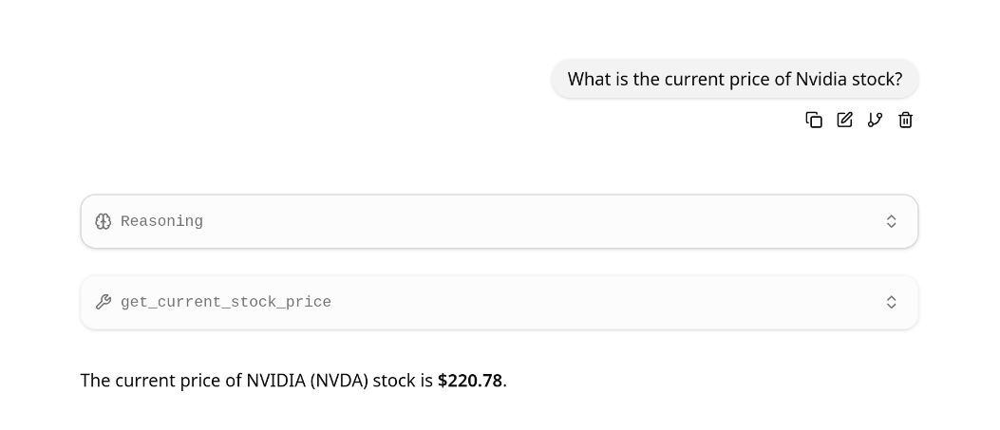

# super-trader-mcp-server
MCP Server offering a set of tools for traders and investors


# Running released version

**Note: all instructions below are provided for Linux and bash. However, similar steps should work for other platforms**

```bash
# download the latest release package from https://github.com/kubawoo/super-trader-mcp-server/releases/latest, for instance
wget https://github.com/kubawoo/super-trader-mcp-server/releases/download/0.1.0/super_trader_mcp_server-0.1.0-py3-none-any.whl

# create virtual env
python3 -m venv .venv

# activate virtual env
source .venv/bin/activate

# install super-trader-mcp-server
pip install super_trader_mcp_server-0.1.0-py3-none-any.whl

# (optional) set server port
export FASTMCP_PORT=8000

# start the server
python3 -m super_trader_mcp_server.main

# (optional) check app is up and running
curl http://localhost:8000/health

```

# Running from source code

Prerequisites:
- Python 3.13 or newer
- git
- uv (Python's package/project manager - https://github.com/astral-sh/uv)

```bash
# clone the repository
git clone https://github.com/kubawoo/super-trader-mcp-server.git

# go to source root
cd super-trader-mcp-server

# (optional) set server port
export FASTMCP_PORT=8000

# start server
uv run super-trader-mcp-server

# (optional) check app is up and running
curl http://localhost:8000/health

```

# Setting up llama.cpp integration

## Start llama.server

First of all, you need a running llama.cpp server. There are several ways of doing that, here we will use a pre-built
package from https://github.com/ggml-org/llama.cpp/releases/latest
You will also need a model (LLM) that will be used to communicate with our MCP server. The following ones were tested
and seem to be working quite well:
- Gemma4
- GPT OSS

The easiest way is to use llama.cpp to download the models directly from HuggingFace (https://huggingface.co)

```bash
# download the latest release matching your platform
wget https://github.com/ggml-org/llama.cpp/releases/download/b9124/llama-b9124-bin-ubuntu-x64.tar.gz

# extract the archive
tar xf llama-b9124-bin-ubuntu-x64.tar.gz

# change to llama directory
cd llama-b9124

# start the server and use the GPT OSS 20B model
./llama-server -hf ggml-org/gpt-oss-20b-GGUF --port 8001

```

Now you should be able to access the llama.cpp Web UI by navigating your favorite browser to http://localhost:8001



## Add MCP Server

In the Web UI you click on the `MCP Servers` and then `+ Add New Server`. In the new dialog you need to specify the MCP 
Server's url, which in our case is http://localhost:8000/mcp

If everything went fine, you should be able to see something similar to this:



## Test the server

Start a new chat, and make sure that the SuperTrader server is enabled


Ask for current price of any stock of your choice. You might be prompted to allow the usage of SuperTrader's tools, 
and after that you should see something like this:
